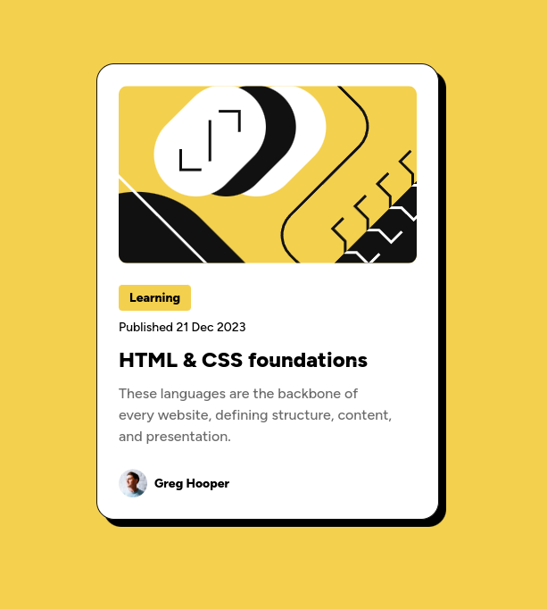
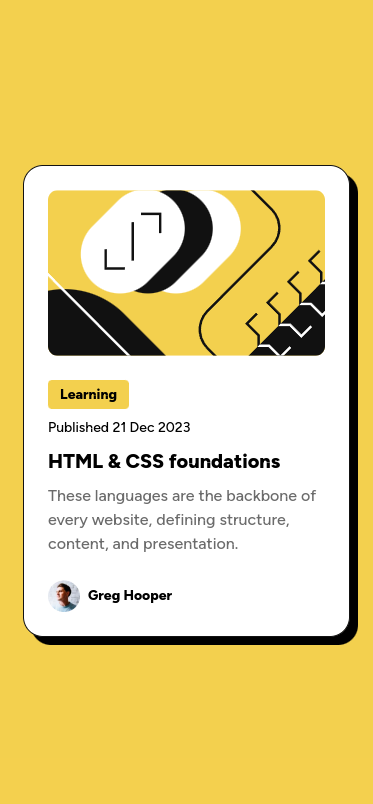

# Frontend Mentor - Blog preview card solution

This is a solution to the [Blog preview card challenge on Frontend Mentor](https://www.frontendmentor.io/challenges/blog-preview-card-ckPaj01IcS). Frontend Mentor challenges help you improve your coding skills by building realistic projects.

## Table of contents

- [Overview](#overview)
    - [The challenge](#the-challenge)
    - [Screenshot](#screenshot)
    - [Links](#links)
- [Built with](#built-with)
- [Author](#author)

**Note: Delete this note and update the table of contents based on what sections you keep.**

## Overview

### The challenge

Users should be able to:

- See hover and focus states for all interactive elements on the page

### Screenshot

### Links

- Solution URL: [https://github.com/maxim-green/blog-preview-card-main](https://github.com/maxim-green/blog-preview-card-main)
- Live Site URL: [https://maxim-green.github.io/blog-preview-card-main/](https://maxim-green.github.io/blog-preview-card-main)

## Built with

- Webstorm
- Semantic HTML5 markup
- CSS variables
- Flexbox

## Author

- Website - [Maxim Green](https://maxim-green.github.io/)
- Frontend Mentor - [@maxim-green](https://www.frontendmentor.io/profile/maxim-green)